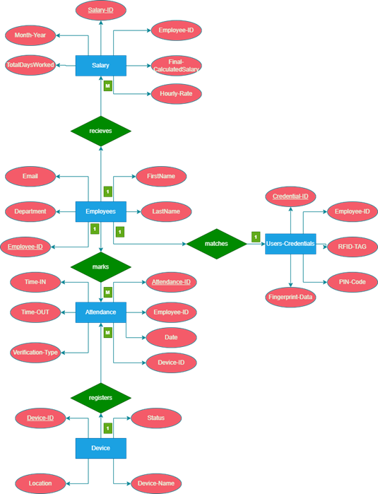
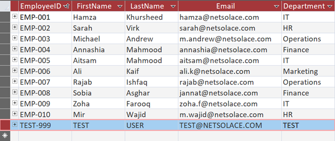
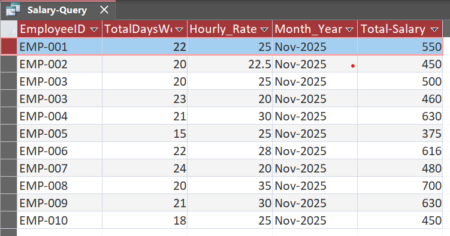

# Employee Attendance Management System
## ER Diagram

## MS Access Frontend

## Salary Calculation Output

## Description
A database-driven attendance system with automatic salary calculation.

## Features
- Biometric authentication (3 methods)
- Salary auto-calculation based on attendance
- Structured relational database

## Tech Stack
- SQL
- MS Access
